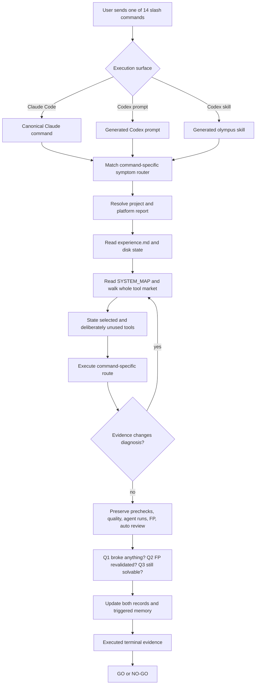
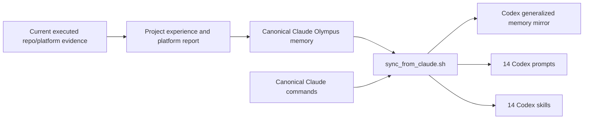

# Olympus slash-system audit and operating map — 2026-08-24

Scope: the shared Olympus/Mars workflow, its 14 slash commands, Claude Code and Codex ports, generalized
Olympus memory, the 49-file workflow manifest, and the Olympus Console deployment. ERIS and ULH are excluded.

## Executive verdict

The shared system has been repaired and independently exercised. This audit does **not** claim that unknown
bugs are impossible; it proves the named surfaces are coherent now, and that the new completeness claims have
canaries which demonstrate the checks can fail.

The fixed bar is not adapted. The **method** is adapted from the current repo, feature, agent regime, local
`experience.md`, local `PLATFORM_CHECK_REPORT.md`, and executed artifacts. When those sources disagree, current
disk/platform execution wins, the contradiction is recorded, and the workflow is corrected rather than
forcing the project to fit stale doctrine.

## Claude Code and Codex: one canonical system

| Surface | Authority and behavior | Audit proof |
|---|---|---|
| Claude commands | `~/.claude/commands/*.md` is canonical. Claude reads the matching file in full. | 14 canonical command files exist and pass route/content checks. |
| Codex prompts | `~/.codex/prompts/*.md` is generated from the Claude command. | Sync installed and verified all 14 prompt copies. |
| Codex skills | `~/.codex/skills/olympus-*/SKILL.md` wraps the same canonical command. | Sync installed and verified all 14 skill copies. |
| Manual fallback | If slash expansion is unavailable, read the canonical Claude command file in full and execute it. | Codex global instructions explicitly provide this fallback. |
| General memory | Claude's Olympus memory directory is canonical; Codex memory is a generated mirror. | Sync verified 22 memory triples and 24 installed Codex memory files. |
| Shared workflow | `~/Desktop/olympus-workflow/` is read live by both tools; it is not copied into Codex. | Manifest and on-disk inventory agree at 49/49. |

If memory contradicts current evidence, **evidence wins**. The correction belongs in the project records first;
only a durable cross-project lesson is promoted to canonical memory and then synchronized to Codex.

## The complete 14-command route matrix

Every command begins with the common opening shown above. This table identifies the command-specific symptom,
first decisive action, adaptation point, and proof of completion.

| Command | Send it when | First command-specific actions | Evidence-driven adaptation | Required finish |
|---|---|---|---|---|
| `/new-sub` | Starting a new Olympus submission | Resolve repeat-repo vs fresh-repo; read the appropriate accepted corpus/debrief; run invention route 01→02→03→04 and both GATE ZERO checks before implementation | Candidate, repo seams, prior art, constructed wrong variants, and measured walls determine the feature and difficulty dossier | Six deliverables, complete FP floor, then `/validate`; no separate speed mode |
| `/new-chat` | Resuming a project in a fresh context | Reconstruct truth from disk and full `experience.md`; if the log is lost, use recovery; if disk disagrees, disk wins | Chooses normal recovery, lost-log reconstruction, doctrine catch-up, submitted-state reconstruction, or `/new-sub` if nothing exists | Current state/constraints restored, `/catch-up` applied, then resume the exact open item |
| `/continue` | Continuing interrupted work or adding an instruction mid-wave | Read the latest resume/fix ledger; verify partial artifacts rather than trusting prose | Selects mid-fix resume, compacted-context recovery, half-regeneration integrity, new-instruction satisfy-all, or contradiction third-state route | One coherent completed wave with records updated |
| `/end` | Checkpointing before leaving a chat | Inventory exact open work and disk state; do not pad a no-change session | Distinguishes mid-wave, green, unanalyzed batch, stale chat, and dying-feature states | `experience.md` current plus an exact `RESUME HERE` pointer; `/pivot` if the feature is dying |
| `/catch-up` | Re-syncing an existing project to current doctrine | Manifest preflight; reconstruct state sheet; read every post-marker ledger row and answer its verdict question | Applies only relevant post-marker laws to current artifacts; never turns old doctrine into rote edits; a batch is rejudged from its own evidence | Marker advances only after changes and `/validate`; NO-GO is a useful result, not a failure to hide |
| `/pivot` | The feature is genuinely dying | Diagnose why, extract all reusable lessons, create `PIVOT_HANDOFF.md`, archive feature artifacts | Evidence decides what is reusable infrastructure versus dead feature logic | Clean handoff; same repo retained; user starts a fresh chat with `/revamp` |
| `/revamp` | Starting a new feature after `/pivot` | Read the full handoff and project history; verify archive boundaries; rerun all GATE ZERO work on a new core | Old lessons power a materially different feature; no old novelty clearance or feature core is inherited | New same-repo feature enters full creation pipeline |
| `/fix-prechecks` | A platform precheck fails | Identify the exact precheck/group; reproduce it; route similarity findings to plagiarism logic | Repairs the whole visible failure class while preserving unrelated gates | Full pre-submit gates rerun, including affected FP mapping and records |
| `/fix-quality` | Fairness, environment, flakiness, task, solution, or description check fails | Classify exact lane; reproduce; ask the fairness question; inspect all sibling findings and coverage suggestions | A disclosure must preserve/restore difficulty; flakiness gets repeated execution; stated requirements are not weakened | Fixed quality lane plus affected full gate/FP validation and logs |
| `/fix-agent-runs` | A batch over-solves, under-solves, looks unfair, or has suspicious passers | Read all eight artifacts for every run; fingerprint regime; audit every passer; compute histogram, FDI, and counterfactual | Failure shape selects over-solve, zero-solve, environment, unfairness, or cheat route; solver proxies remeasure changes before another batch | At least one mined genuine passer, honest failure distribution, and evidence for the next triad/validate step |
| `/fix-fp` | An FP panel/verifier finding arrives | Ingest the full verdict before fixing; reproduce candidate/reference/base; classify contract, real bug, or reference bug | Remedy order is narrow → delete → gate; Layer A and Layer B choose the actual surface; panel remedy is not blindly trusted | Seven FP passes, five-source replay, executable floors/canaries, and handoff to triad solvability |
| `/fix-auto-review` | Any auto-review lane is below the local bar | Parse every lane and build one historical demand list; determine whether a batch changed the reviewed surface | Fix the full class, not one sentence; post-batch passer code is audited because it affects Solution/Code | Post-batch auto review rerun, all demands disposed, triad re-entered if FP/passers changed |
| `/validate` | Before platform submission, after a material fix, or transforming an old project | Preflight manifest; choose Mode V (prove) or Mode T (transform); require an artifact for each of five stages | Current project evidence chooses the implementation of each proof; no stage can be replaced by confidence or memory | Five-row scoreboard, mined passer, predicted verdict, and GO/NO-GO |
| `/validate-triad` | FP, solvability, and auto review must be brought to one consensus | Create a unique run directory; execute FP first, solvability second, post-batch auto review last | Each lane may force return to an earlier lane; fixes are accepted only if Q1/Q2/Q3 still hold | Six immutable files plus checksum and a ≥95%-confidence READY/NOT READY report |

### `/validate-triad` artifact contract

The six ordered artifacts are `00_CONTEXT.md`, `01_INTAKE.md`, `02_FP_SWEEP_<RUN_ID>.md`,
`03_SOLVABILITY.md`, `04_AUTO_REVIEW.md`, and `05_FINAL_VALIDATION_REPORT.md`. `MANIFEST.sha256` protects the
bundle. Missing/empty/reused files, count mismatches, or checksum mismatches void the run.

## Every workflow artifact has a live job

Round 6 now checks a stronger claim than existence: every manifest artifact must have an incoming consumer
outside itself, `MANIFEST.md`, `DOCTRINE_LEDGER.md`, and the auditing checker. Its dummy-artifact canary proves
that an unconsumed file fails. That stronger check exposed `README.md` and `convergence.py`; both are now
explicitly routed in `SYSTEM_MAP.md`.

| Artifact | Operational role | Example live consumer/route |
|---|---|---|
| `AUDIT_PING.md` | Independent system-audit brief | `SYSTEM_MAP`, `/validate` |
| `COMMAND_PREAMBLE.md` | Shared invariant opening for all commands | `SYSTEM_MAP`, all generated commands |
| `DIFFICULTY_GATE.md` | D1-D6 difficulty dossier | `FIELD_CARD`, `/new-sub` route |
| `FP_LAW.md` | One FP entry point; seven-pass and five-source law | all validation/fix commands |
| `FP_LIVE_VERDICTS.md` | Verbatim live FP verdict corpus | `FP_LAW`, `/fix-fp`, `/validate-triad` |
| `retired_tokens.sh` | Rejects active retired doctrine | `FIELD_CARD`, full harness |
| `verify_fp_evidence.sh` | Verifies accepted FP evidence mirrors | `FP_LAW`, `/validate` |
| `COMMAND_TABLE.md` | Human-readable command behavior registry | `SYSTEM_MAP` |
| `SYSTEM_MAP.md` | First-read task/symptom router and toolbox | every command via preamble |
| `FP_MACHINE_AUDIT.md` | Layer B code-machine decomposition | FP routes and `fp_kill_protocol` |
| `FP_SYSTEM.md` | Input-space axis pass | `FP_LAW` seven-pass route |
| `FP_SYSTEM_V2.md` | Verdict-library and authoring-battery pass | `FP_LAW`, FP route |
| `01_analyze.md` | Repo excavation and candidate generation | `/new-sub`, `STARTUP_PROMPT` |
| `02_verify.md` | Candidate verification | `/new-sub`, `01_analyze` |
| `03_creation_prep.md` | Contract and build preparation | `/new-sub`, `04_create` |
| `04_create.md` | Six-deliverable construction mechanics | `/new-sub`, `STARTUP_PROMPT` |
| `AGENT_RUNS_PING.md` | Batch-intake paste block | `/fix-agent-runs` |
| `CONVERGENCE_LAW.md` | Failure-shape counterfactual doctrine | `/fix-agent-runs`, `SYSTEM_MAP` |
| `convergence.py` | Executable histogram/counterfactual | zero-solve symptom route in `SYSTEM_MAP` |
| `DOCTRINE_LEDGER.md` | Append-only doctrine propagation source | `/catch-up`, audit routes |
| `FIELD_CARD.md` | Tier-0 current bars and registry | command/workflow startup routes |
| `FP_AUDIT_PING.md` | Pre-agent-run FP audit paste block | `SYSTEM_MAP`, `/validate` |
| `FP_HANDBOOK.md` | Promise-minus-gate and survivor triage | FP and convergence routes |
| `MAIN_GOAL.md` | One-sentence objective and priority chain | `SYSTEM_MAP`, `STARTUP_PROMPT` |
| `MANIFEST.md` | Canonical integrity inventory | `/catch-up`, `/validate` |
| `MEMORY_LAW.md` | Memory authority, grades, and write triggers | all command universal blocks |
| `LEARNING_LAW.md` | Fix→study→record→iterate→revalidate | `/validate-triad`, universal learning loop |
| `PLATFORM_CHECK_REPORT.md` | Moving-platform observations and predictions | all commands and project report resolver |
| `README.md` | Workflow ownership and maintenance entry points | maintenance/audit route in `SYSTEM_MAP` |
| `STARTUP_PROMPT.md` | Canonical startup and command registry | `/new-sub`, sync/registry checks |
| `catch_up_prompt.md` | Doctrine transformation method | `/catch-up`, startup routing |
| `community_fp_tips.md` | Verbatim community FP/fairness canon | FP and quality routes |
| `fix_auto_review.md` | Lane rubrics and satisfy-all method | `/fix-auto-review`, review routes |
| `fix_reviewer_comment.md` | Reviewer-first diagnosis | quality and auto-review routes |
| `fp_kill_protocol.md` | Layer A promise decomposition and floor | all FP routes |
| `olympus_accepted.md` | Acceptance debrief template | accepted-project route |
| `olympus_experience.md` | Project log/constraint schema | all project lifecycle commands |
| `pivot_protocol.md` | Same-repo feature retirement | `/pivot`, `/revamp` |
| `platform_baseline.md` | Measured platform/agent regime baseline | difficulty and validation routes |
| `platform_spec.md` | Platform stages and exact checks | precheck, quality, validation routes |
| `pre_submit_gate.md` | Executable GATES 0-12 wall | `/validate`, `/new-sub`, fix routes |
| `prompt_difficulty.md` | Wall construction and measurement | `/new-sub`, `/fix-agent-runs` |
| `prompt_fix_ai_runs.md` | Batch diagnosis and recovery | `/fix-agent-runs` |
| `prompt_fix_plagiarism.md` | Similarity/prior-art repair | `/fix-prechecks`, GATE ZERO routes |
| `prompt_recover_project.md` | Lost-log reconstruction | `/new-chat` |
| `prompt_validation.md` | Full validation route | `/validate`, creation route |
| `repeat_repo_prompt.md` | Repeat-repo debrief extraction | `/new-sub`, `/new-chat` |
| `repo_scan_ledger.md` | Repo selection/saturation record | repository-selection route |
| `verifier_audit_study.md` | Verifier-completeness taxonomy | FP creation/validation routes |

## Defects found in this final audit wave

1. `SYSTEM_MAP.md` still called `/new-sub` “speed mode” and its command overview omitted `/validate-triad`.
2. The map did not expose `COMMAND_PREAMBLE.md`, `FP_SYSTEM.md`, or `FP_SYSTEM_V2.md` in the relevant indexes.
3. Round 6 claimed prompt reachability while accepting mere manifest presence, so a dummy prompt could pass.
4. No check proved that all 49 declared artifacts had a live incoming consumer.
5. `convergence.py` and `README.md` were present but not meaningfully routed.
6. One `FIELD_CARD.md` band row ambiguously described 40% as an absolute cap while canon allows a guarded
   41-50% spent-margin route.

All six were repaired. Ledger row 160 records the doctrine/routing change. Round 6 now has independent
canaries for prompt reachability, the exact 14-command overview, and manifest-artifact consumption.

## How to use the repaired system in an existing project

For the cleanest state transition, start a **fresh chat in that project's folder**:

1. Send `/new-chat`. It reconstructs project truth from disk and `experience.md`, then performs catch-up.
2. If you deliberately skip reconstruction because the project state is already loaded, send `/catch-up`.
3. Let `/catch-up` finish its `/validate` scoreboard. A NO-GO means the synchronization found real work; do
   not run a new platform batch until the named gaps are fixed.

This works in both Claude Code and Codex. In Codex, the slash prompt and `olympus-new-chat` / `olympus-catch-up`
skills are equivalent entry points; the canonical-file fallback is always available. Start a fresh chat so
the tool loads the regenerated command definitions and memory mirror.

## Honest boundary

The shared system can be green while an old project remains stale. Historical project-specific backlogs are
therefore reported, not hidden: older projects can contain retired mode blocks or lack project-specific
memories. `/new-chat` + `/catch-up` is precisely the route that audits and transforms each one. No project is
ready merely because the shared workflow is ready.

## Commit and deployment state

The console, evidence log, and this report are committed locally. The commit is not on GitHub and
is not deployed: GitHub accepts the configured identity for reads but rejects a harmless blob-write probe with
HTTP 403 because the fine-grained token lacks effective Contents write access. SSH has no authorized key, and
the connected browser could not complete GitHub navigation. The local Git remote was sanitized so it no longer
stores a plaintext token.

This is the only incomplete requested action. Once the token at `API KEY` has **Repository permissions →
Contents: Read and write** for `aurumstylesbrand-source/olympus-analyzer`, the remaining evidence sequence is:
push `main` → trigger Render service `olympus-analyzer` → wait for live → verify `/health`, the new band, and
`solvability` on the served page. Until then the correct terminal verdict is **NOT READY FOR RERUN**.
